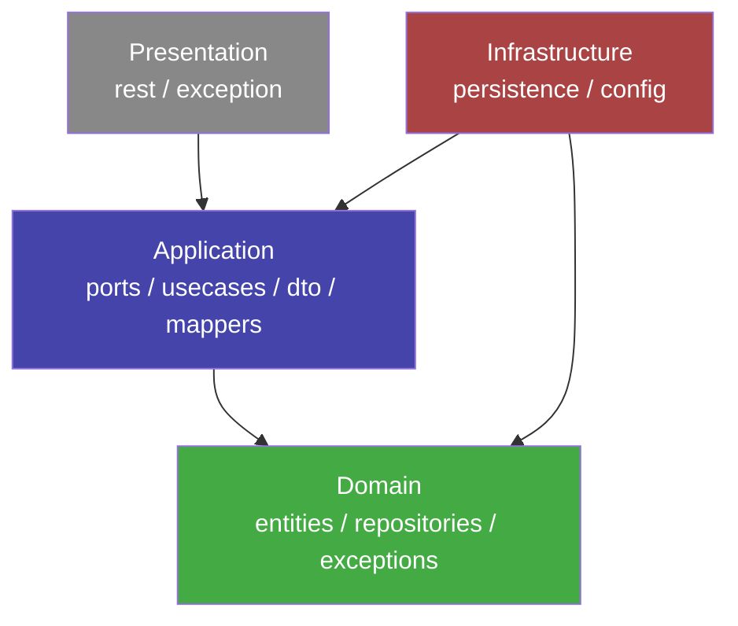

# Generated Clean Architecture

The built-in Spring Boot generator produces a strict **Clean Architecture** (Uncle Bob) layout.  
Dependencies always point inward: Presentation → Application → Domain. Infrastructure implements domain interfaces — the domain never imports from infrastructure.

---

## Package layout

For `--package com.example.myapp` with entities `Student` and `Course`:

```
com/example/myapp/
│
├── domain/
│   ├── entities/
│   │   └── Student.java                        # Pure POJO, zero framework deps
│   ├── repositories/
│   │   └── IStudentRepository.java             # Port interface (domain defines what it needs)
│   └── exceptions/
│       ├── EntityNotFoundException.java
│       └── EntityAlreadyExistsException.java
│
├── application/
│   ├── dto/
│   │   ├── CreateStudentRequest.java           # Use-case input contract
│   │   ├── UpdateStudentRequest.java           # Use-case input contract
│   │   ├── StudentResponse.java                # Full read model
│   │   └── StudentSummaryResponse.java         # Lightweight list item
│   ├── mappers/
│   │   └── StudentDtoMapper.java               # MapStruct interface (no Spring, wired via BeanConfig)
│   ├── ports/
│   │   └── crud/student/
│   │       ├── ICreateStudent.java
│   │       ├── IFindByIdStudent.java
│   │       ├── IFindAllStudent.java
│   │       ├── IUpdateStudent.java
│   │       └── IDeleteStudent.java
│   └── usecases/
│       └── crud/student/
│           ├── CreateStudentUseCase.java
│           ├── FindByIdStudentUseCase.java
│           ├── FindAllStudentUseCase.java
│           ├── UpdateStudentUseCase.java
│           └── DeleteStudentUseCase.java
│
├── infrastructure/
│   ├── persistence/
│   │   ├── entities/
│   │   │   └── StudentJpaEntity.java           # JPA model (Lombok + Hibernate timestamps)
│   │   ├── repositories/
│   │   │   └── StudentJpaRepository.java       # Spring Data JPA interface
│   │   ├── mappers/
│   │   │   └── StudentEntityMapper.java        # MapStruct (componentModel = "spring")
│   │   └── adapters/
│   │       └── StudentRepositoryAdapter.java   # Implements IStudentRepository
│   └── config/
│       ├── BeanConfig.java                     # Wires use cases + DtoMappers as @Bean
│       └── JacksonConfig.java
│
└── presentation/
    ├── rest/
    │   └── StudentController.java              # 5 CRUD endpoints
    └── exception/
        ├── GlobalExceptionHandler.java         # @RestControllerAdvice
        └── ApiError.java                       # Uniform error envelope
```

---

## Dependency rules



!!! warning "Infrastructure never imports from Presentation"
    Infrastructure implements domain ports (`IStudentRepository`). It knows about Domain and Application — never about controllers or exception handlers.

---

## Per-entity file count

Each entity in the diagram produces **22 files**:

| Layer | Files | Count |
|---|---|---|
| Domain | entity, repository interface, 2 exceptions (shared) | 2 |
| Application | 2 DTOs + 2 requests + mapper + 5 port interfaces + 5 use cases | 14 |
| Infrastructure | JPA entity, JPA repo, entity mapper, adapter | 4 |
| Presentation | controller | 1 |
| Global (shared, once) | BeanConfig, JacksonConfig, GlobalExceptionHandler, ApiError | 4 |

---

## What a use case looks like

Every use case follows the same structure — a single `execute()` entry point delegating to private methods:

```java title="application/usecases/crud/student/CreateStudentUseCase.java"
public class CreateStudentUseCase implements ICreateStudent {

    private final IStudentRepository repository;
    private final StudentDtoMapper    mapper;

    @Override
    public StudentResponse execute(CreateStudentRequest request) {
        Student entity = toDomain(request);  // (1)
        Student saved  = persist(entity);    // (2)
        return toResponse(saved);            // (3)
    }

    private Student toDomain(CreateStudentRequest request) {
        return mapper.toDomain(request);
    }
    private Student persist(Student entity) {
        return repository.save(entity);
    }
    private StudentResponse toResponse(Student entity) {
        return mapper.toResponse(entity);
    }
}
```

Use cases are **plain Java classes** — no `@Service`, no Spring dependency. They are wired by `BeanConfig` as `@Bean` definitions.

---

## REST endpoints (per entity)

| Method | Path | Use case | Status |
|---|---|---|---|
| `POST` | `/api/v1/students` | `CreateStudentUseCase` | 201 |
| `GET` | `/api/v1/students/{id}` | `FindByIdStudentUseCase` | 200 / 404 |
| `GET` | `/api/v1/students?page=0&size=20` | `FindAllStudentUseCase` | 200 |
| `PUT` | `/api/v1/students/{id}` | `UpdateStudentUseCase` | 200 / 404 |
| `DELETE` | `/api/v1/students/{id}` | `DeleteStudentUseCase` | 204 / 404 |
