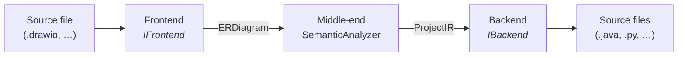

# Transpiler pipeline

uml2code follows a classic **three-stage compiler architecture**.  
Each stage communicates through a typed intermediate representation and depends only on abstract port interfaces — swapping a frontend or backend requires no change to any other stage.

---

## Stages



| Stage | Input | Output | Built-in impl |
|---|---|---|---|
| **Frontend** | Raw file content (`str`) | `ERDiagram` | `DrawIOFrontend` |
| **Middle-end** | `ERDiagram` | `ProjectIR` | `SemanticAnalyzer` (fixed) |
| **Backend** | `ProjectIR` | Files on disk | `SpringBootCleanGenerator` |

The `Pipeline` class is a thin orchestrator — it calls the three stages in sequence and has no logic of its own:

```python title="src/pipeline/pipeline.py"
@dataclass
class Pipeline:
    frontend:  IFrontend
    analyzer:  SemanticAnalyzer
    backend:   IBackend

    def run(self, source: str, package: str, output_dir: Path) -> list:
        diagram = self.frontend.parse(source)
        ir      = self.analyzer.analyze(diagram, package)
        files   = self.backend.generate(ir)
        self.backend.write(files, output_dir)
        return files
```

---

## Intermediate representations

### `ERDiagram` — source AST

Produced by the frontend. Carries source-specific details (cell IDs, raw type strings, visibility symbols). Different frontends may produce different `ERDiagram` shapes; the middle-end normalizes all of them.

```
ERDiagram
├── entities: dict[id → EREntity]
│   ├── id, name
│   ├── fields:  list[ERField]   (name, type as written, visibility)
│   └── methods: list[ERMethod]
└── relationships: list[ERRelationship]
    ├── source_id, target_id
    └── kind: INHERITANCE | COMPOSITION | AGGREGATION | ASSOCIATION
```

### `ProjectIR` — target-agnostic IR

Produced by the middle-end. Contains only normalized, backend-ready information. No trace of draw.io, no Java types — nothing that ties it to a specific input or output.

```python title="src/core/ir/project_ir.py"
@dataclass
class ProjectIR:
    package:  str
    entities: list[IREntity]

@dataclass
class IREntity:
    name:         str
    fields:       list[IRField]
    parent:       IREntity | None     # set by INHERITANCE
    compositions: list[IREntity]      # set by COMPOSITION
    aggregations: list[IREntity]      # set by AGGREGATION / ASSOCIATION

    @property
    def is_root(self) -> bool:        # True when parent is None
        return self.parent is None
```

!!! note "Type names are passed through unchanged"
    The middle-end never maps `string → String` or `int → Integer`.  
    Type normalization is each backend's responsibility — it belongs in the backend's own type map.

---

## Middle-end: Semantic Analyzer

The semantic analyzer (`src/middleend/semantic_analyzer.py`) is the only stage with no implementation variants. It is intentionally **format-agnostic and target-agnostic**:

1. Converts each `EREntity` → `IREntity` (copy fields, capitalize names)
2. Resolves relationships and applies them to the IR:
    - `INHERITANCE` → sets `IREntity.parent`
    - `COMPOSITION` → appends to `IREntity.compositions`
    - `AGGREGATION` / `ASSOCIATION` → appends to `IREntity.aggregations`
